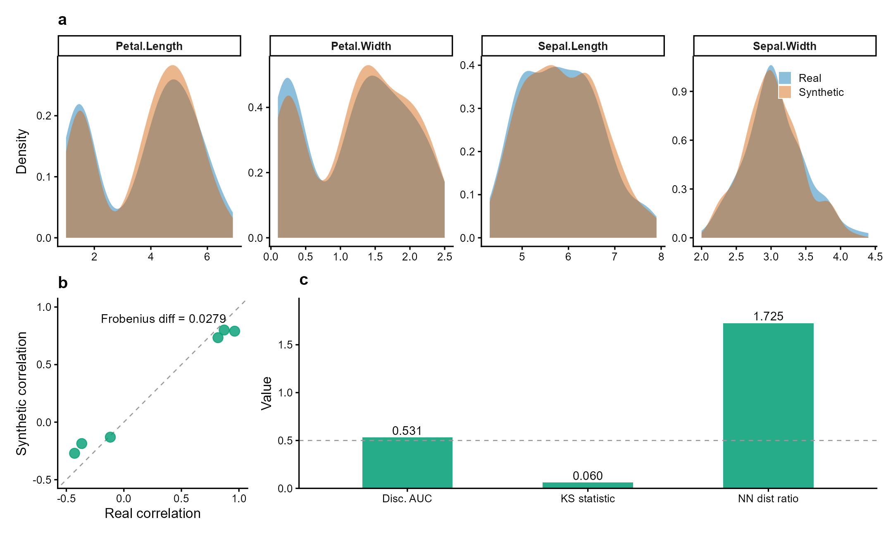

<div align="center">

# syntheticdata

*Synthetic Clinical Data Generation with Privacy-Utility Validation*

[](https://github.com/CuiweiG/syntheticdata/actions/workflows/R-CMD-check.yml)
[](https://opensource.org/licenses/MIT)

</div>

---

## Overview

`syntheticdata` generates synthetic clinical datasets that preserve
statistical properties while reducing re-identification risk.
Useful for privacy-aware data sharing in multi-site clinical
research.

- **Methods**: Gaussian copula (parametric), bootstrap with noise,
  Laplace noise perturbation
- **Validation**: distributional fidelity (KS), correlation
  preservation, discriminative accuracy, nearest-neighbor privacy
- **Two core functions**: `synthesize()` + `validate_synthetic()`

---

<div align="center">

</div>

> **Figure 1 | Synthetic data preserves statistical properties
> while ensuring privacy.** Fisher's iris dataset (*n* = 150,
> 4 numeric variables) synthesized via Gaussian copula.
> (**a**) Marginal density overlays: synthetic (orange)
> closely matches real (blue) across all variables (mean
> KS = 0.06). (**b**) Pairwise correlation preservation
> (Frobenius diff = 0.028). (**c**) Validation metrics:
> discriminative AUC = 0.53 (indistinguishable from random),
> nearest-neighbor distance ratio = 1.73 (no privacy leakage).
> Data: Fisher (1936) *Ann. Eugenics* 7:179.

---

## Installation

```r
# From GitHub:
devtools::install_github("CuiweiG/syntheticdata")

# After CRAN acceptance:
install.packages("syntheticdata")
```

## Quick start

```r
library(syntheticdata)

# Synthesize from real clinical data
syn <- synthesize(iris, method = "parametric", seed = 42)
syn

# Validate utility and privacy
validate_synthetic(syn)
```

## Functions

| Function | Description |
|----------|-------------|
| `synthesize()` | Generate synthetic data (parametric / bootstrap / noise) |
| `validate_synthetic()` | Compute utility and privacy metrics (KS, AUC, NN ratio) |

---

## Key references

- Jordon J et al. (2022). Synthetic Data -- what, why and how?
  *Nat Mach Intell* 4:805. doi:10.1038/s42256-022-00534-z
- Snoke J et al. (2018). General and specific utility measures
  for synthetic data. *JRSS-A* 181:663. doi:10.1111/rssa.12358

## License

MIT
